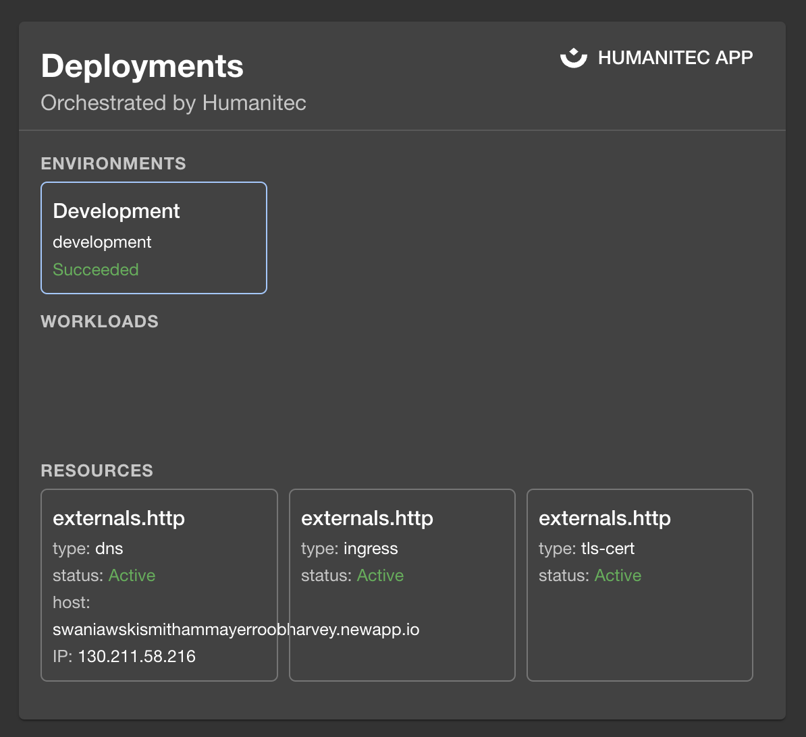

# @humanitec/backstage-plugin

`@humanitec/backstage-plugin` is a plugin for the Backstage frontend app. It shows information about environments, workloads and resources on an entity page.



## Requirements

This plugin requires `@humanitec/backstage-plugin-backend` because it connects to the backend to make requests to the Humanitec API.

## Installation

### Entity card

First, install the plugin to your backstage app:

```bash
yarn workspace app add @humanitec/backstage-plugin
```

Then in your Entity Page (`./packages/app/src/components/catalog/EntityPage.tsx`) add the `HumanitecCardComponent`:

```diff
+ import { HumanitecCardComponent } from '@humanitec/backstage-plugin';
...
const overviewContent = (
  <Grid container>
    ...
+   <Grid item md={6}>
+     <HumanitecCardComponent />
+   </Grid>
  </Grid>
)
```

In case the Humanitec component should only be display when the entity has Humanitec annotations configured,
the code could look like the following:

```diff
+ import { HumanitecCardComponent, hasHumanitecAnnotations } from '@humanitec/backstage-plugin';
...
const overviewContent = (
  <Grid container>
    ...
+   <EntitySwitch>
+     <EntitySwitch.Case if={hasHumanitecAnnotations}>
+       <Grid item md={6}>
+         <HumanitecCardComponent />
+       </Grid>
+     </EntitySwitch.Case>
+   </EntitySwitch>
  </Grid>
)
```

Add annotations to types that have Humanitec apps display:

```yaml
# ./catalog-humanitec-workloads.yaml
apiVersion: backstage.io/v1alpha1
kind: Component
metadata:
  name: name-of-application-workload # 🚨 CHANGE
  description: Humanitec Workload Environments
  annotations:
    "humanitec.com/orgId": "my-humanitec-organization" # 🚨 CHANGE
    "humanitec.com/appId": "my-humanitec-application" # 🚨 CHANGE
spec:
  type: service
  owner: john@example.com
  lifecycle: experimental
```

Lastly in your `./app-config.yaml`, add configuration to `humanitec`:

```diff
humanitec:
  orgId: my-humanitec-organization
  token: ${HUMANITEC_TOKEN} # without Bearer
```

When you start your backstage app be sure to pass in `HUMANITEC_TOKEN` that you must generate from your Humanitec dashboard.

### Scaffolding field extension

For an enhanced scaffolding experience (`./packages/app/src/App.tsx`) add the `ValidateHumanitecAppIDFieldExtension`, which validates that the provided input is a valid Humanitec Application ID.

```diff
+ import { ValidateHumanitecAppIDFieldExtension } from '@humanitec/backstage-plugin';
...
const routes = (
  <FlatRoutes>
    ...
    <Route path="/create" element={<ScaffolderPage />}>
      <ScaffolderFieldExtensions>
+       <ValidateHumanitecAppIDFieldExtension />
      </ScaffolderFieldExtensions>
    </Route>
    ...
  </FlatRoutes>
)
```

Once this has been added, `ui:field: ValidateHumanitecAppID` is available inside scaffolding templates.
